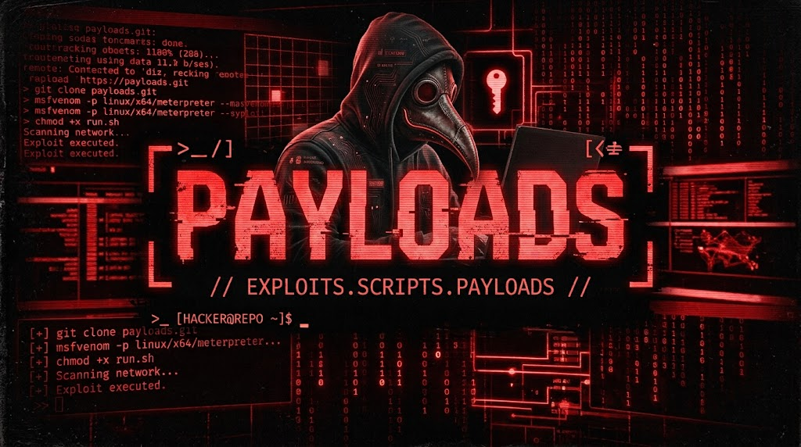

# yersinia



Real attacker commands and payloads, captured and classified live from a controlled honeypot environment ([Oráculo SOC](https://github.com/drplagash)). Plain text, no synthetic data — every file here is something an attacker actually typed or served against a real (emulated) service.

The companion credential dictionaries (usernames/passwords/combos) live in [pandemia](https://github.com/drplagash/pandemia). Real malware binaries recovered from these sessions live in a separate repo, cross-referenced here by SHA256 once available.

Updated automatically, every 12 hours.

## What's in here

### `comandos-frecuentes.txt` — always the latest snapshot

Unique shell commands attackers actually ran, most-repeated first. Full regenerate every run.

### `sesiones/` — full attack sequences, one file per day

Individual commands out of context aren't very useful — a session usually tells a story (OS fingerprinting → download attempt → persistence). This folder groups commands by the actual session they came from, in the order they were typed, one file per date (`sesiones/YYYY-MM-DD.txt`). Incremental — new sessions get appended as they happen, nothing is regenerated from scratch. Source IPs are redacted to the /24 (last octet replaced with `XYZ`).

### `familias/` — captured payloads, classified

Files and scripts fetched during an investigation (HTTP downloads, dropped scripts, served pages), sorted into a folder per classification. Each file is named by a short SHA256 identifier and contains a header with the sample's metadata followed by its plain-text content:

```
familias/
└── <classification>/
    └── <sha256-short>.txt
```

Right now the only classification with real samples is `script_generic` — benign login/default pages picked up while investigating attacker infrastructure. No actual malware has been captured yet; as soon as it is, it gets its own classification folder here (`downloader/`, `backdoor/`, `cryptominer/`, `c2_client/`, etc.) and the corresponding binary goes into the malware repo, cross-referenced by SHA256.

## Source

Captured via [Cowrie](https://github.com/cowrie/cowrie)/[ADBHoney](https://github.com/adbhoney/adbhoney) honeypots (part of a [T-Pot](https://github.com/telekom-security/tpotce) deployment) plus follow-up automated investigation of attacker infrastructure. No source IPs, internal topology, or infrastructure details beyond the redacted /24 are published here.

## Updates

`comandos-frecuentes.txt` regenerates fully every run. `sesiones/` and `familias/` are incremental — only new sessions/samples since the last run get added.

## Disclaimer

For security research and authorized testing only. These are real attacker-supplied commands and payloads collected in a controlled, isolated lab. Text content is published as-is for research purposes — do not execute anything from `familias/` outside an isolated, disposable environment.

## License

MIT — see [LICENSE](LICENSE).
